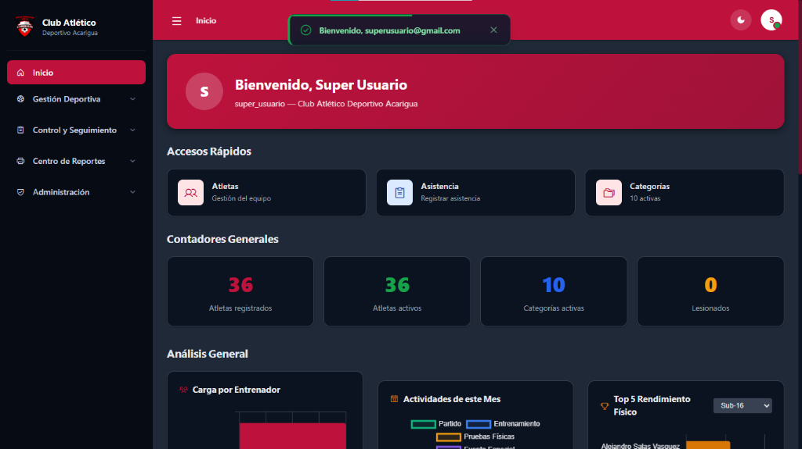
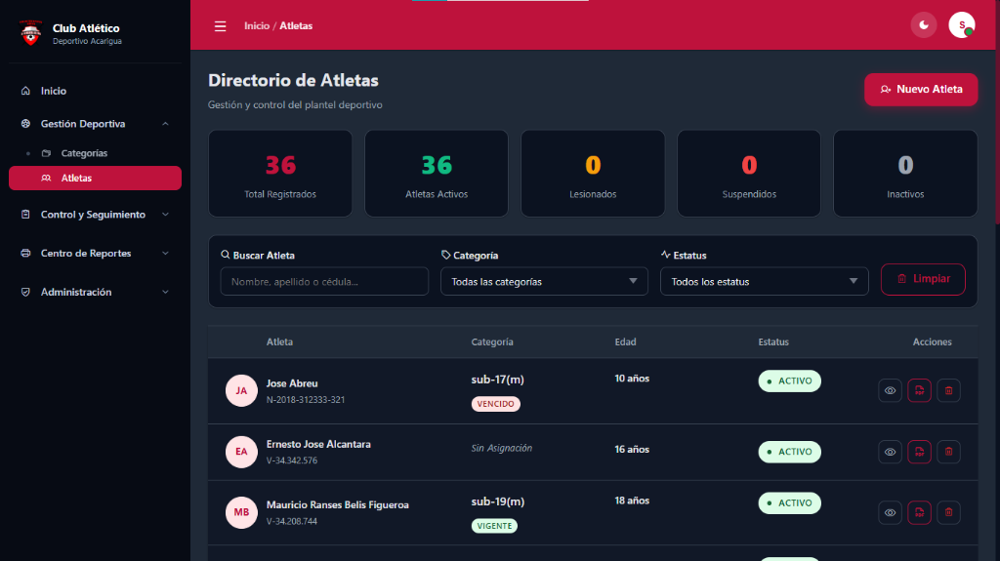

# 🦅 Club Atlético Deportivo Acarigua - Sistema de Gestión Deportiva

Este proyecto es una aplicación web integral diseñada para la recopilación, monitoreo y análisis antropométrico del rendimiento deportivo de los atletas del **Club Atlético Deportivo Acarigua**.

---

## 📖 Descripción del Proyecto

El sistema centraliza la información técnica y médica del club, facilitando el seguimiento del progreso físico de los jugadores a través de mediciones periódicas, control de asistencias, convocatorias y generación de reportes técnicos detallados.

### 🌟 Características Principales

- **Gestión de Atletas:** Registro detallado de deportistas con información personal, técnica, médica y de contacto (incluyendo representante y dirección detallada con cascada de ubicación geográfica del país).
- **Monitoreo Antropométrico:** Historial y evolución de mediciones de peso, altura, envergadura e índices de masa corporal (IMC).
- **Evaluación de Rendimiento:** Registro de tests físicos especializados (Fuerza, Resistencia, Velocidad, Coordinación y Reacción) para análisis deportivo.
- **Ficha Médica Digital:** Historial de salud, alergias, condiciones crónicas, antecedentes familiares y control detallado de discapacidades (con soporte para paginación fija a 5 registros).
- **Consultas Médicas:** Registro cronológico de visitas médicas, diagnósticos, tratamientos y observaciones del atleta.
- **Control de Asistencias y Convocatorias:** Registro diario de presencia en entrenamientos/partidos por categorías y llamado a convocatorias.
- **Gestión del Plantel y Usuarios:** Administración y control del personal del club con roles de seguridad específicos.
- **Reportes Técnicos en PDF e Impresión:** Generación e impresión de fichas técnicas individuales con gráficos y métricas de progreso (usando TCPDF o fallback HTML imprimible).
- **Seguridad:** Control de Acceso Basado en Roles (RBAC), protección CSRF, rate limit y autenticación segura con **JSON Web Tokens (JWT)** con renovación automática (Keep-Alive con periodo de gracia).

---

## 🛡️ Seguridad y Roles (RBAC)

El sistema implementa un modelo de Control de Acceso Basado en Roles (RBAC) con **5 roles de usuario** distintos para garantizar la integridad y privacidad de la información:

1. **Súper Usuario:** Acceso absoluto e ilimitado a todos los módulos, configuraciones y usuarios (bypass total de permisos).
2. **Administrador:** Acceso de gestión y control del sistema. Puede administrar usuarios, categorías, atletas y configuraciones (salvo operaciones reservadas al Súper Usuario).
3. **Entrenador:** Orientado al seguimiento deportivo diario. Puede registrar asistencias, convocatorias, y actualizar datos de **Rendimiento y Antropometría** de los atletas. Acceso de solo lectura a datos personales y médicos básicos. Sin acceso a configuraciones ni plantilla del personal.
4. **Directivo:** Rol de supervisión y gestión institucional. Posee permisos equivalentes al Administrador para visualización y operaciones.
5. **Médico:** Rol especializado en el cuidado de la salud del atleta. Tiene permisos exclusivos para crear y actualizar **Fichas Médicas** y **Consultas Médicas**, además de acceso a la configuración general.

### Matriz de Permisos

| Módulo | Súper / Admin | Directivo | Médico | Entrenador |
| :--- | :---: | :---: | :---: | :---: |
| **Atletas (Datos Personales)** | Escritura | Escritura | Lectura | Lectura |
| **Ficha Médica (Salud)** | Escritura | Escritura | **Escritura** | Lectura |
| **Consultas Médicas** | Escritura | Escritura | **Escritura** | Sin Acceso |
| **Rendimiento y Antropometría** | Escritura | Escritura | Lectura | **Escritura** |
| **Control de Asistencias (Pase)** | Escritura | Escritura | Sin Acceso | **Escritura** |
| **Control de Asistencias (Edición)**| Escritura | Escritura | Sin Acceso | Sin Acceso |
| **Convocatorias (Creación/Pase)** | Escritura | Escritura | Sin Acceso | **Escritura** |
| **Convocatorias (Edición/Baja)** | Escritura | Escritura | Sin Acceso | **Escritura** |
| **Gestión del Plantel / Usuarios** | Escritura | Escritura | Sin Acceso | Sin Acceso |
| **Configuración del Sistema** | Escritura | Escritura | **Escritura** | Sin Acceso |
| **Reportes e Impresión** | Todos | Todos | Todos | Todos |

---

## 📊 Visualización de Gráficos y Estadísticas

El sistema utiliza de manera combinada dos de las mejores librerías de visualización en JavaScript, adaptadas localmente para optimizar la carga y rendimiento:

### ⚡ ECharts (Apache ECharts)
Cargada de forma local (`/assets/js/lib/echarts.min.js`) y CDN en módulos individuales. Se utiliza en:
- **Perfil del Atleta - Pestaña Antropometría:** Gráfica de línea del historial antropométrico (evolución temporal de peso, talla y envergadura).
- **Perfil del Atleta - Pestaña Ficha Médica/Consultas:** Gráfica de Radar para la evaluación y comparación del rendimiento deportivo nacional (FUTVE) e internacional.
- **Perfil del Atleta - Pestaña Asistencia:** Gráfica de Dona interactiva que resume el porcentaje de asistencia, inasistencias y faltas justificadas.
- **Evolución Antropométrica Individual (`medidas/atleta`):** Gráfica de doble línea de tiempo para la progresión física detallada.

### 📈 Chart.js
Utilizada para analíticas globales en tableros y comparativas. Se utiliza en:
- **Dashboard Principal (`dashboard/index`):**
  - *Categorías por Entrenador:* Gráfico de barras de asignaciones.
  - *Distribución de Actividades:* Gráfico de dona (Entrenamientos vs Partidos vs Eventos).
  - *Porcentaje de Asistencia Reciente:* Gráfico de líneas temporales de los últimos 15 días.
  - *Top Rendimiento Físico:* Gráfico de barras horizontales con mejores puntajes.
  - *Crecimiento del Roster:* Gráfico de área que muestra la evolución de la matrícula de atletas.
  - *Consistencia Deportiva:* Gráfico de radar con métricas agregadas de puntualidad, asistencia e inasistencias.
- **Módulo de Categorías (`categorias/index`):**
  - *Distribución de Atletas por Categoría:* Gráfico de barras de carga deportiva.
  - *Demografía General:* Gráfico circular de distribución por sexo.
- **Evolución Física Individual (`resultados_pruebas/atleta`):** Gráfica de Radar de rendimiento en pruebas físicas.

---

## 🧰 Stack Técnico

- **Backend:** PHP 8.1+ (Arquitectura limpia MVC propia sin frameworks pesados, PDO, inyección segura de dependencias, validador de formularios y JWT HS256 vanilla).
- **Frontend:** Plantillas PHP dinámicas renderizadas en servidor + CSS Vanilla Premium estructurado en variables de diseño, íconos de Phosphor Icons, y componentes interactivos modulares en Vanilla JavaScript (Toasts, Modales, Validadores).
- **Base de datos:** MySQL 8 / MariaDB 10.4+ (UTF-8 `utf8mb4`, modelo altamente normalizado y triggers de integridad global para evitar duplicidad de cédulas).
- **Reportes:** TCPDF (vía Composer) con fallback automático a HTML optimizado para impresión física.

---

## 📁 Estructura del Proyecto

```
├── app/                  # Código PHP (MVC)
│   ├── Core/             # Núcleo: Router, DB (PDO), JWT, Auth, Validator, etc.
│   ├── Middleware/       # Filtros de ruta: Auth, Role (RBAC), CSRF, Médico
│   ├── Controllers/
│   │   ├── Web/          # Controladores de vistas HTML
│   │   └── Api/          # Controladores API REST (JSON)
│   ├── Models/           # Modelos de base de datos
│   ├── Services/         # Lógica de negocio avanzada (PDF, subida de archivos)
│   ├── Views/            # Vistas y templates HTML/PHP
│   └── Helpers/          # Constantes y funciones globales auxiliares
├── config/               # Archivos de configuración (app, database, auth, routes)
├── database/
│   ├── cada_db_clean.sql # Esquema completo limpio y normalizado
│   └── install.php       # Instalador automático por consola
├── public/               # Raíz pública del servidor web
│   ├── index.php         # Front Controller principal
│   └── assets/           # Recursos estáticos: CSS (diseño premium), JS, librerías locales
└── storage/logs/         # Registro y auditoría de eventos de seguridad del sistema
```

---

## 🐳 Despliegue con Docker (Recomendado)

El proyecto incluye un stack de contenedores Docker listo para producción o desarrollo local.

### Uso Rápido
1. Levantar contenedores:
   ```bash
   docker compose up -d --build
   ```
2. La aplicación estará disponible en `http://localhost:8080` y la base de datos MariaDB en el puerto local `3307`.

---

## 🚀 Instalación y Configuración Local

### Requisitos
- PHP 8.1 o superior (con extensiones: `pdo_mysql`, `mbstring`, `gd`, `json`).
- MySQL 8 / MariaDB 10.4+ en ejecución.
- (Opcional) Composer instalado para generación de PDF binarios.

### Pasos
1. **Configurar variables de entorno:**
   ```bash
   cp .env.example .env
   ```
   Genera una clave secreta JWT segura:
   ```bash
   php -r "echo bin2hex(random_bytes(32));"
   ```
   Colócala en la variable `JWT_SECRET` dentro de tu `.env` junto con tus credenciales de base de datos.

2. **(Opcional) Instalar dependencias PHP:**
   ```bash
   composer install
   ```

3. **Ejecutar el instalador de la Base de Datos:**
   ```bash
   php database/install.php
   # O para reiniciar la BD limpiamente:
   php database/install.php --fresh
   ```

4. **Levantar el servidor local:**
   ```bash
   php -S localhost:8000 -t public
   ```
   Accede en tu navegador a `http://localhost:8000`.

---

## 🔑 Credenciales de Prueba y Demostración

El instalador inicializa la base de datos con cuentas de prueba listas para evaluar cada rol (Contraseña para todas las cuentas: `12345678`):

- **Súper Usuario:** `superusuario@gmail.com`
- **Administrador:** `administrador@gmail.com`
- **Entrenador:** `entrenador@gmail.com`
- **Directivo:** `directivo@gmail.com`
- **Médico:** `medico@gmail.com`

---

## 🔐 Notas de Seguridad Implementadas

- **Protección de Sesión:** El JWT se almacena de forma segura en una cookie `httpOnly` con bandera `SameSite=Lax` para anular ataques XSS y CSRF.
- **CSRF Token:** Validación obligatoria de tokens anti-falsificación en todas las peticiones mutacionales (`POST`).
- **Rate Limiting:** Límite estricto de 5 intentos fallidos de inicio de sesión cada 5 minutos por IP/cuenta.
- **Consultas Seguras:** Consultas preparadas parametrizadas en PDO en todo el sistema.
- **Auditoría:** Registro automático de acciones sensibles (`login`, `logout`, registro/baja de atletas) en `/storage/logs`.

---

## 🧪 Pruebas Rápidas de Verificación (Smoke Tests)

Una vez completada la instalación, verifique el correcto flujo en:
1. `GET /login` -> Inicie sesión con la cuenta de su elección.
2. `GET /admin/atletas` -> Acceso al listado, visualice un perfil y pruebe los botones de edición y pestañas antropométricas/médicas.
3. `GET /admin/asistencias/crear` -> Realice un pase de asistencia por categoría.
4. `GET /admin/medidas/atleta/{id}` -> Compruebe la carga y renderizado de la gráfica local de evolución física.
5. `GET /admin/reportes` -> Genere y descargue la Ficha Técnica de un atleta en PDF.

---

## 📸 Capturas de Pantalla del Sistema

Aquí se muestran algunas interfaces del sistema en funcionamiento:





